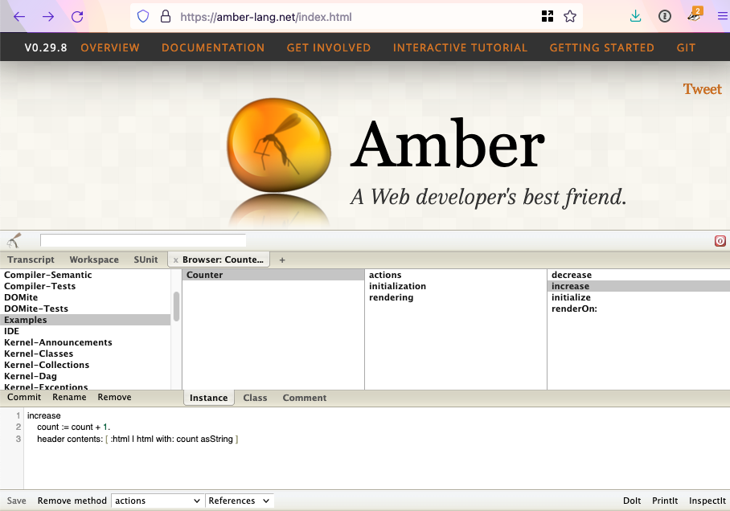

Let's consider in what ways Smalltalk and HyperCard empower people, and what we can learn from that about how we can empower users today.

***

(Consider referencing automatic storage)

How do Smalltalk and HyperCard empower people?

Both systems empower people by removing many technical barriers between users and developers. Modifying your software doesn't require installing and setting up a complex separate environment, and configuring complex build tools. If you are using the system, you have the tools to develop in it and the source for the system. Although there are different user levels in HyperCard, this serves to provide small steps from user to developer: you take gradual steps and eventually find out you're programming. In Smalltalk, there are no user levels: from the moment you send your first message to an object, you're doing what all the code in the system does, so it's all theoretically accessible to you.

This removal of barriers supports programming by refinement. In HyperCard you start creating software by making small customizations to an existing stack, then assembling new stacks from premade parts, then writing your own parts from scratch. In Smalltalk you start creating software by sending a message to an object that already exists, then you assemble objects into bigger systems, then you customize an object by adding or modifying a method, then you create classes from scratch.

Although the HyperTalk and Smalltalk programming languages have many differences, they both place a higher priority than their contemporary languages on easy readability by people, including non-technical people. This was in service to both helping people learn to program and removing low-level implementation details, allowing people to focus on the software they were building.

There is a slightly different strategy between the two systems: Smalltalk attempts to empower people to learn to program, whereas HyperCard attempts to empower people to create software *without* learning to program until absolutely necessary.

In Smalltalk, the code is primary, and everything comes from the code. If you're using software in Smalltalk, you can inspect it to see what objects are behind it. To make adjustments to it or to create your own software, you will need to begin programming. Once you do, there is no limit to what you can customize, because almost everything in the Smalltalk environment is written in itself.

HyperCard, by contrast, is designed to make it easy for you to modify and create software without programming at first. You can first inspect and modify stacks using a graphical interface, including things like linking buttons to other cards. Then you can go further by finding buttons in stacks or libraries and copying them into your stack along with their behavior. From there you can begin scripting using the accessible HyperTalk language. Beyond that point, though, the learning curve spikes. To extend the environment to do something that isn't built in you need to get different programming tools and program in a different language. And you can't change HyperCard itself: it's proprietary compiled software.

The result was that HyperCard empowered a lot of non-programmers to create and distribute software via stacks, something that didn't happen so much in Smalltalk. Smalltalk empowered a significant amount of commercial software, and continues to empower research. But maybe more enduringly, Smalltalk empowered the creation of agile practices. Its flexibility allowed and inspired new ways of thinking about the software development process itself. Once they were invented, agile practices could be applied to less flexible languages than Smalltalk--not everyone needs to invent new software development methodologies.

***

Looking to the present and future, is there a need for the kind of empowerment that Smalltalk and HyperCard provided? Do many users need to customize their software? Do many users need to create interactive experiences?

1. Maybe there is not currently a need for any of the ways Smalltalk and HyperCard empower users.
2. Maybe there is a need, and HyperCard or Smalltalk themselves meet that need as they are.
3. Maybe there is a need, but it's a need that is not possible to meet given today's constraints.
4. Maybe there is a need and it can be met by enhancing existing tools or creating new tools.

Let's consider these possibilities in turn.

First, **1. maybe there is not currently a need for any of the ways Smalltalk and HyperCard empower users.**

It would be easy to draw this conclusion by looking at market pressures. Commercial and traditional source-code-based open-source software is sufficient for most users most of the time, including the customization settings they offer. And the benefits of those environments for providing full-featured functionality outweigh any slight benefits that customization might provide. And people don't want or need to create interactive experiences: they want to create documents and post to social media.

I think there are a few reasons not to take this view. First of all, the fact that people make do with limitations in software doesn't mean it's ideal. People adapt to what they're presented with, even to the extent of handling things that are significantly harmful to them. Instead of forcing users to adapt to software, it would be ideal if people could adapt their software to themselves. As an example of adapting software to yourself, I use an open-source social network, and when I found a feature of it wasn't helpful to my stress level, I forked the client and removed that feature. I was only able to do this because I'm a professional software developer with experience with the technical stack it's written in. If we could empower more users to customize their software, more of them would benefit in this way.

Second, Henry Ford and Steve Jobs famously designed products based not on what people were asking for but based on a vision for what they would really benefit from. Now, I'm no visionary like Ford or Jobs, but I don't have to be: all I have to do is look at the impact Smalltalk and HyperCard have had in the past. I read the examples of children and non-technical users creating things in Smalltalk and HyperCard, the ways that salespeople could record what they knew to automate a process, the way a student-teacher was able to create a simulation to teach others. When I read these, I see the potential that regular people have to use the power of the computer to make their lives and others' lives better, if they're only given software that empowers them.

Bill Atkinson said:

> I'm a populist. I want everybody to be empowered. I think the more people that are empowered, and particularly those that have passion about something, and they want to share it with other people--

(Legacy 16:47)

If the question you ask is "do users who are not developers need the ability to create or modify software," you've biased the question: you've assumed a distinction between users and developers. Instead of making that assumption, what if we just thought about people? Then the question might be "does it benefit people to empower them to create software more easily?" And I think the obvious answer is yes. We should find ways to allow developers to create software more complex than they ever have before. We should make it easier for developers to create software of the same complexity we've created before, by creating good abstractions and elimitating accidental complexity. We should make it easier for people to learn to become developers. And we should make it easier for people to create and modify software without having to become a developer.

**2. Maybe there is a need, and HyperCard or Smalltalk themselves meet that need as they are.**

For HyperCard, the answer seems clear: it would be difficult to make the argument that HyperCard itself fully meets the need of empowering users. It does not run on modern hardware or operating systems, is discontinued commercial software, and as a result has significant downsides that have not been updated over the course of almost 20 years.

HyperCard's successor LiveCode does empower developers to compile apps cross-platform in a high-abstraction programming language. But because its apps are distributed as compiled software, it doesn't empower Bill Atkinson's growth path, where non-programmers use others' creations, customize them, learn from them, and eventually build their own.

Can a version of Smalltalk help? Let's consider the options:

- Squeak and Pharo are still empowering researchers and some professional developers. But the fact that they only run on desktop computers, not mobile phones, limits the ability of non-programmers to create software they can use where they are.
- [SqueakJS](https://squeak.js.org/) allows normal Squeak images to run in a browser. This is helpful for compatibility purposes, but most Squeak images are too heavyweight for normal web app use. Changes you make to the image are persisted in browser storage, but there isn't a clear path in place for how to preserve that image durably or share changes with other users.
- [Amber](https://amber-lang.net/) is a Smalltalk-based language that compiles to JavaScript that has access to the DOM. This makes building browser applications in it feasible. But Amber only seems to allow modifying the system in development mode, whereas in production it runs off of compiled JavaScript. Also in my assessment Amber hasn't been able to draw a critical mass of developers to be able to equip it with rich documentation and a library ecosystem.

So HyperCard, Smalltalk, and related tools aren't an obvious fit for empowering users in this way.

**3. Maybe there is a need, but it's a need that is not possible to meet given today's constraints.**

Is this the conclusion we need to come to? Do Apple's phone restrictions and the expectations of users mean that it's not possible to empower users to customize their software?

I don't think it's categorically impossible; I think we can envision a tool that would meet the need. It would need to have the following attributes:

- It would need to run on both desktop and mobile devices, even accounting for Apple's App Store restrictions.
- It would not need to support every hardware and user interface feature of the platforms it runs on, but it would need to provide enough of a toolkit to create useful software, including operating on different screen sizes.
- Users would need to have a way to easily share the software they create with one another.
- When a user is using the software, they would need to already have all the tools they need to inspect it and modify it.
- There would need to be a way to make ongoing development and maintenance economical, even though it would not be possible to charge for the platform so that it can function as an exchange medium. Presumably, it would need to be open source.

None of these needs are technically insurmountable, so I think we can conclude:

**4. Maybe there is a need and it can be met by enhancing existing tools or creating new tools.**

There is some creativity required around figuring out what toolkit of functionality is useful and what mechanism of sharing works best. The main challenge is economic: can something be created that is useful enough to bootstrap enough interest to get community support to continue open source development? It remains to be seen.

***

Alan Kay, one of the creators of Smalltalk, famously takes a long-term view on computing. In "The Computer Revolution Hasn't Happened Yet" he describes what it would take for computing to reach its destiny, allowing computational complexity to scale by factors of a trillion, to match the computational complexity that already happens in living organisms. I don't have the foresight to assess that view or make my own prediction for what the far future of computing should be. But I can do what Bill Atkinson suggested and "make ethical and aesthetic choices about different futures."

In my assessment, it is better for software to empower people more instead of less. Because of this, it is worthwhile to invest in finding new ways to empower people to create and modify their software. A given avenue of research may fizzle, or may prompt the next idea that has more of an impact, or it may itself have an impact for a few people or many, for a year or twenty. But trying to find ways to empower people with software is a goal that is worth the effort.
