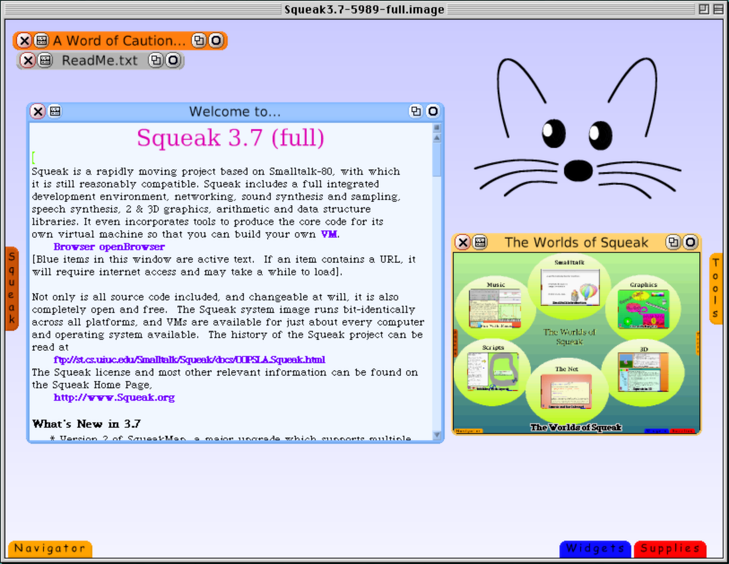
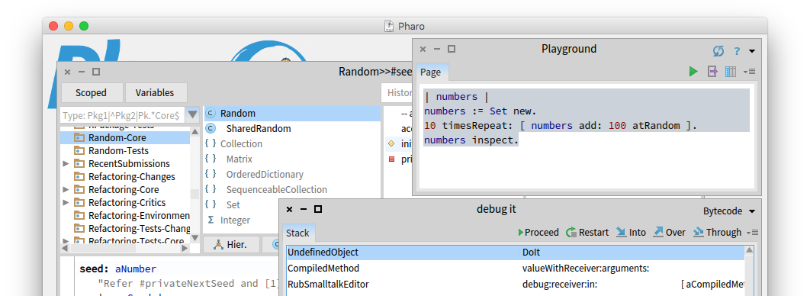

What other products emerged to compete with Smalltalk and/or carry on its legacy?

Smalltalk's first contemporary competitor was C++. In *Object Thinking*, David West describes C++ and Smalltalk as two different successors to Simula, taking object-oriented programming in two different directions. (Advocates of Smalltalk would argue that C++ is not true object-oriented programming, and they have Alan Kay, who coined the term, in their corner.)

C++ alongside C has continued to be used for many purposes, especially for systems and low-level programming. From an enterprise software standpoint Smalltalk's biggest competitor was Java. The rise of Java was one of the key factors to the decline of commercial Smalltalk.

As commercial Smalltalk implementations declined in popularity, [Squeak](https://squeak.org/) was created as an open-source Smalltalk implementation:

> Dan, Alan Kay, and their colleagues at Apple, Disney, and some universities used Squeak as a research platform, much as they had used the original Smalltalk at Xerox PARC.

(WB)

Squeak has continued to be developed since then, and is still available on modern computers.

[Pharo](https://pharo.org/) was created as a fork of Squeak. Wirfs-Brock describes it as:

> a streamlined, more industrialized, and less research focused version of Smalltalk.

(WB)

The book *Pharo by Example*, written by the lead maintainer of Pharo, says

> Pharo strives to offer a lean, open platform for professional software development, as well as a robust and stable platform for research and development into dynamic languages and environments.
