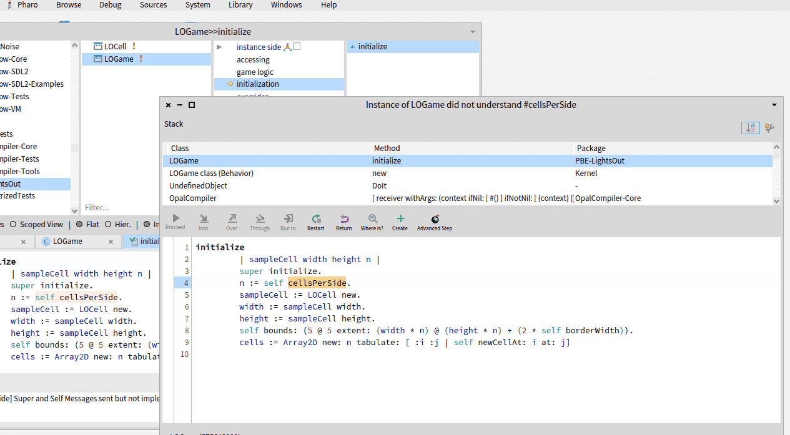

What defining characteristics influence how Smalltalk uniquely works?

## Everything is an Object
For developers who are used to languages like C++ or Java (which Smalltalkers would call "not fully object-oriented"), it can be surprising to see that in Smalltalk *everything* is an object, down to the simplest primitive integer or boolean.

A design principle behind this is:

> Uniform Metaphor: A language should be designed around a powerful metaphor that can be uniformly applied in all areas.

The uniform metaphor here is objects sending messages.

But what is the point of this principle? Why should it be applied, even when it seems like it may have an adverse performance impact? Here is an example (emphasis mine):

> …control in the system becomes complicated if processing is performed extrinsically. Let us consider the process of adding 5 to a number. In most computer systems, the compiler figures out what kind of number it is and generates code to add 5 to it. This is not good enough for an object-oriented system because *the exact kind of number cannot be determined by the compiler* (more on this later). A possible solution is to call a general addition routine that examines the type of the arguments to determine the approximate action. This is not a good approach because it means that this critical routine must be edited by *novices who just want to experiment with their own class of numbers.* It is also a poor design because intimate knowledge about the internals of objects is sprinkled throughout the system.

The phrase "novices who just want to experiment with their own class of numbers" is the key. We'll take it one subphrase at a time:

- "Their own class of numbers." Smalltalk is designed to allow users to write their own totally different way of representing and handling numbers. This is why numbers cannot be primitives--they would not be able to be changed. But numbers are only one example: Smalltalk is designed to allow users to write their own class of *anything*, and have it interface with the rest of Smalltalk. Smalltalk doesn't say "we handle numbers this way; if you want to handle numbers differently, write your own language." Instead, Smalltalk says "this Smalltalk image has this number class, but if you want to try to handle numbers differently, we'll support it."
- "Novices." It is novices, not only programming language theorists, who are to be enabled to experiment with their own class of numbers.
- "Just want to experiment." In this view, trying out a new way to handle numbers should not be a massive undertaking requiring creating one's own programming language. *A novice should be able to do a quick experiment handling numbers in a totally different way.*

This is the kind of research, the kind of flexibility, that Smalltalk is designed to support. It is not to say that every user of Smalltalk will want to change the way numbers work; it is to say that *someone* will want to change the way *anything* works, and so everything should be an object written in Smalltalk that receives messages, so that it can be changed.

## Automatic Storage Management
"Design Principles Behind Smalltalk" says:

> Storage Management: To be truly "object-oriented", a computer system must provide automatic storage management.

In context, "storage management" refers to managing objects in memory:

> Objects are created when expressions are evaluated, and they can be passed around by uniform reference, so that no provision for their storage is necessary in the procedures that manipulate them. When all references to an object have disappeared from the system, the object itself vanishes, and its storage is reclaimed.

Although it's not explicit in "Design Principles", the handling of persisting code and data (which are the same thing in Smalltalk) is also automatic. All running objects are persisted out to the image on disk and loaded back in from there.

An impact of both aspects of storage management is apparent in the code:

> A way to find out if a language is working well is to see if programs look like they are doing what they are doing. If they are sprinkled with statements that relate to the management of storage, then their internal model is not well matched to that of humans.

This concept is related to levels of abstraction and expressive code. Smalltalk code represents the conceptual objects, and little attention needs to be paid to allocating memory or to serializing or deserializing data.

## Integrated Environment
On most development platforms, there are boundaries between your tooling, your source code, the underlying language/libraries, your compiled program, and the debugger.

In Smalltalk, most of the barriers between these are removed. Your own code, Smalltalk's core classes, and the classes that implement your editor and debugger all run in the same memory, and the source for each is available and modifiable.

This has many impacts:

- Instead of having to start up a full "program" to try something out, you can send messages to objects and see how they respond. This can lead to a design approach where you have highly composable objects that work in many contexts, not just in one particular program.
- Anywhere there is text, you can select it and choose "do it" to execute it as Smalltalk code. This includes in comments and in transcript output.
- When you run into an error running your program locally, the debugger launches. You can inspect the state of your objects that led to the error. You can send them messages and see how they respond. Instead of having to imagine how your program is while running, you can see and interact with exactly what's happening as it runs. You can also add or modify methods and then continue the program running. There's a common pattern of "debugging code into existence:" you send the message you wish you could send, run the code, then Smalltalk allows you to implement that method to handle that message and then continue execution.
- When an error occurs in production, you can save the state of the image, so that you can use that for troubleshooting. You don't need to try to do enough logging to reproduce a complex production state; you have the state exactly.
- You can pull up the source for "core" Smalltalk classes to learn how they work. You can also add methods to those classes just as easily, or modify existing methods.

## Programming By Refinement
Smalltalk's architecture supports what Adele Goldberg describes as "programming by refinement:"

> If I give you something you can play with and extend…that’s easier than giving you nothing and saying “make something.” …When you start with an object that does something, and then you can put many objects like those together and have them interact, and then extend and make them behave a little bit differently, you can take a very incremental approach to learning how to control a computer system.

(Goldberg 14:22)

And again:

> It fit right into the curriculum ideas for how to teach kids: give them a starting point, and really help them learn how to refine it. And we were really exploring this programming by refinement, and really seeing a whole new software engineering process, where you programmed iteratively. Started out with a prototype, and you kept changing it and working it until it was what you wanted, and then you started figuring out where performance could be improved.

(Goldberg 31:20)

As suggested in Goldberg's quote, extending software happens in Smalltalk in several different ways:

- Objects are made to be composed. You can take existing objects and build them up. And, in fact, since everything is an object, you are always doing this. So there is no difference in building something up from numbers and collections, and building something up from higher-level domain-specific objects.
- Classes can be extended. Both your own classes and classes that are "built in" to Smalltalk (of which there is little distinction) can have methods added to them, or changed in them.
- Changes like the above happen live. Methods are compiled individually when saved, without needing to recompile a whole program. The new code is available right away to objects in memory.

## Self-Contained UI
The original Smalltalks controlled the graphical user interface because they *invented* it: there was no pre-existing GUI. Later, after the creation of the Macintosh and Microsoft Windows, some commercial Smalltalks did work with native operating system widgets. But the Squeak project took a different approach:

> At a time when the world is moving toward native host widgets, we still feel that there is power and inspiration in having all of the code for every aspect of computation and display be immediately accessible, changeable, and identical across platforms.

(Squeak)
